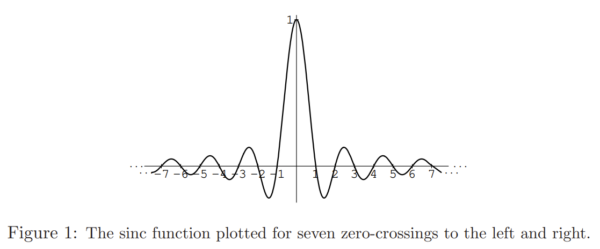
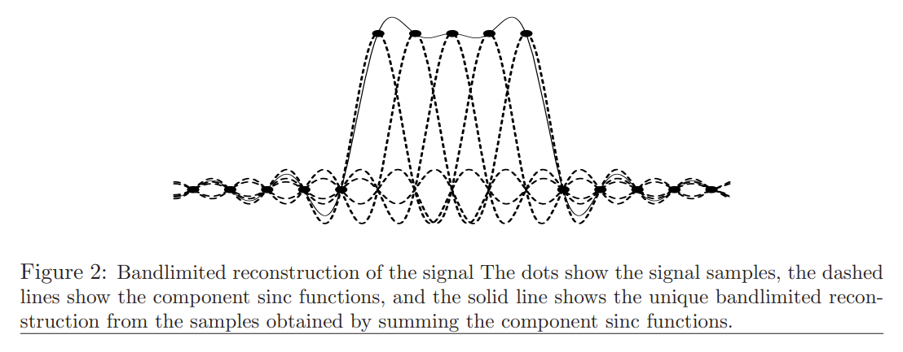
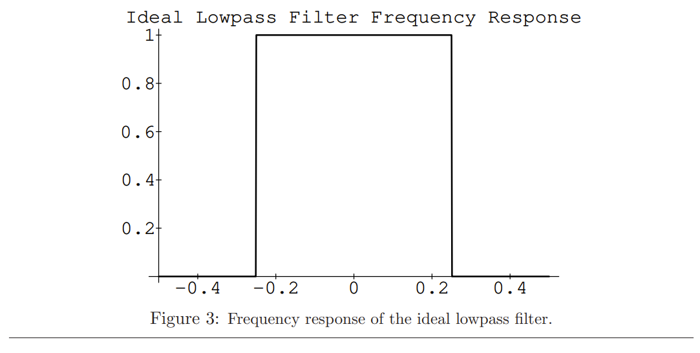
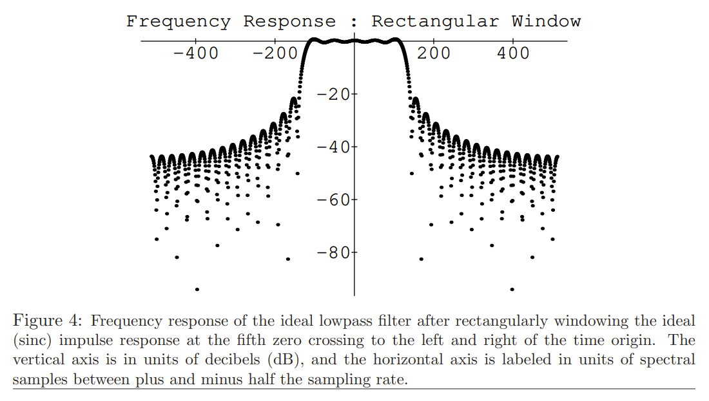
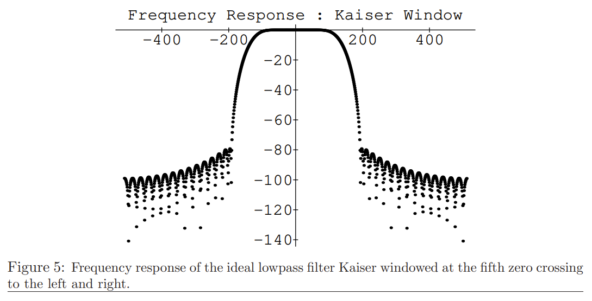

# Digital Audio Resampling 
[homepage](https://ccrma.stanford.edu/~jos/resample/resample.html)
[paper](https://ccrma.stanford.edu/~jos/resample/resample.pdf)

## 1 What is Bandlimited Interpolation?
离散时间信号的*有限带宽插值*是数字信号处理中的一个基本工具。一般来说，问题是如何在任意连续时间，从一组信号幅值的离散时间采样正确的计算信号值。换句话说，我们必须能够对采样点间的信号进行插值。由于总是假设原始信号的带宽不超过采样率的两倍（否则在采样的时候会出现混叠失真的情况），香农采样定理告诉我们可以通过有限带宽插值的方法使用采样对原始信号进行无损重建。

有很多对离散点进行差值的方法，例如拉格朗日插值就是一个经典的方法，它在$N+1$个点钟找到一个$N$阶多项式。三次曲线用经过两个点的三次多项式获得一个点的特定斜率。

还有贝塞尔曲线。

上述方法一般用在图形学上，对于音频信号来说他们都不够理想。在数字音频信号中，重要的是样本间插值错误的可听性。根据香农采样定理，可以从离散采样精确复原原始音频信号，这就意味着最优的数字音频插值器应该是基于这一理论的。这种“理想”差值方法称为*有限带宽插值*。

## 3 Theory of Operation
### 3.1 Abstract
本文介绍了一种对离散时间信号进行*有限带宽插值*的技术，他可以平滑地修改采样率。该方法基于在滤波器参数表中进行差值查找，因此可以在连续时间形式获取滤波器的冲激响应。

### 3.2 Introduction
有很多研究关注离散点插值方法，在这些方法中，首先用一个整数因子$L$对信号进行差值，然后用一个整数因子$M$对其进行十倍下采样。这样，通过有理数因子$L/M$实现了采样率的转换。这种转换需要一个数字低通滤波器，它的截止频率依赖于$\max\{L,M\}$. 尽管很通用，但是这个方程不够方便，比如要在任意时间对信号进行重采样，或者随时间对采样率变换因子进行平滑改变的情况。

本文介绍一种公共领域的重采样算法，它可以在任意时间根据一个定点数对信号进行修改，而且使用一个和采样率变换因子无关的低通滤波器。这个算法有效地实现了采样率变换的analog interpretation. 

### 3.3 Theory of Ideal Bandlimited Interpolation
回顾一下采样率变换的analog interpretation，也就是本方法的基础。

假设有连续的绝对可积信号$x(t)$, 其中t的单位是秒，其采样为$x(nT_s)$, n代表整数，$T_s$是采样周期。假设$x(t)$的带宽范围为$\pm F_s/2$, 其中$F_s=1/T_s$是采样频率。令$X(\omega)$代表$x(t)$的傅里叶变换，即$X(\omega)=\int^{\infin}_{-\infin}x(t)e^{-j\omega t}dt$, 可以假设对于$|\omega|\ge \pi F_s$有$X(\omega)=0$. 因此，香农采样定理告诉我们可以通过下面的公式从采样$x(nT_s)$唯一地重建$x(t)$:
$$
\begin{equation}
\hat{x}(t)\triangleq \sum^{\infin}_{n=-\infin}x(nT_s)h_s(t-nT_s)\equiv x(t)
\end{equation}
$$
其中
$$
\begin{equation}
h_s(t)\triangleq \text{sinc}(F_st)\triangleq \frac{\text{sinc}(\pi F_st)}{\pi F_st}
\end{equation}
$$
要对$x(t)$使用新采样率$F_s'=1/T_s'$进行重采样，只需要在新采样周期$T_s'$的整数倍处求Eq.(1)即可。

当新采样率$F_s'$小于原采样率$F_s$时，低通截止必须位于新采样率的一半以下。这样，对于一个理想低通，$h_s(t)=\min\{1,F_s'/F_s\}\text{sinc}(\min\{F_s,F_s'\}t)$, 其中缩放因子在带通区域保持一致的增益。

sinc函数在原点处的图像如Figure 1所示，在t=0处的峰值幅度为1，在非零的整数点其幅值均为0. sinc函数可以看做是经过双曲线加权后的sin函数。这个名字，sinc来自于它的经典名称 sine cardinal (or cardinal sine)

如果用"*"代表数字信号的卷积操作，则Eq.(1)可以概括为$(x*h_s)(t)$.

Eq.(1)可以解释为多个平移和缩放后的sinc函数的叠加。在每个信号样本处用sinc函数做一次转换，并用该样本对sinc函数进行缩放，然后将所有位置都加在一起。注意到对于sinc函数，其过零点的特性在除了0以外的所有整数处都存在，这意味着在$t=nT_s$时刻（也就是一个采样实例），只有采样点$x(nT_s)$对总和有影响（其余点的值都为0），因此插值精确地经过现有的样本。

Figure 2展示了sinc函数如何通过加和的方式重建一个有限带宽的信号，图中有5个sinc函数的叠加，每一个都是单位幅值，而且都偏移了一个采样间隔。这些sinc函数用来对离散时间信号$x=[...,0,1,1,1,1,1,0,...]$的有限带宽插值进行重建。注意到在每一个采样时刻$t=nT_s$, 实线都刚好穿过对应采样样本的sinc函数的尖端，这再次说明了插值经过现有样本的事实。由于这个数字信号的非零样本都是1，我们也许希望插值后的信号在这些非零区间内很接近于1，但是实际上并不是这样。与样本一致性间的差异可以视作低通滤波器的超调量或者回声，会在半采样率处截止，或者可以将其视为与带宽限制相关的Gibbs现象。

Eq.(1)的第二种解释为：为了获取时刻t处的差值，将信号样本在一个sinc函数下进行移动，这样信号中的时刻t就转移到sinc函数的峰值之下，然后将这些样本通过线性组合的方式得到输出，其中的每个信号样本的系数通过sinc函数在每个位置上的值来获取。第二种解释和第一种是等价的，这一现象可以看做是卷积可交换性质的结果。在第一种解释中，使用所有的信号样本组成移动后的sinc函数的线性组合，而第二种解释，来自于一个sinc函数的样本被用于构建偏移输入信号的线性组合。接下来的实际应用是基于第二种解释。

### 3.4  From Theory to Practice
实际上，Eq.(1)的求和实现不了，因为理想低通滤波器的冲激响应$h_s(t)$实际上是从负无穷到正无穷的。因此在实现的时候为了使理想冲激响应有界就需要进行加窗的操作。这就是数字滤波器设计的加窗方法的基础。尽管还有很多其他的滤波器设计技术，但是加窗方法简单又鲁棒，尤其对于很长的冲激响应。下面提出的算法中，由于过采样很严重，因此滤波器的冲激响应非常长。

Figure 3展示了理想低通滤波器的频率响应，是$h_s(t)$的傅里叶变换。

如果将$h_s(t)$在第5个过零点进行截断，则获取的频率响应如Figure 4所示，注意到抑制带展示只比20dB拒绝稍多一点(? Note that the stopband exhibits only slightly more than 20 dB rejection.)

如果采用Kaiser窗对$h_s(t)$进行操作使其在第五个过零点处减小到0，获得的响应如Figure 5所示。注意到此时的抑制带靠近-80dB. Kaiser窗只有一个参数，可以用于修改抑制带的衰减，将它与从pass-band到stop-band的变换带宽进行trading

### 3.5 Implementation
